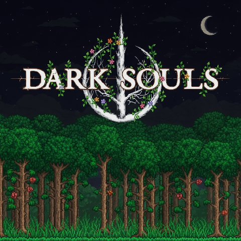

# Dark Souls  
🇬🇧 Content and mechanics from the Dark Souls trilogy of games for Terraria  
🇷🇺 Контент и механики из трилогии игр Dark Souls для Terraria

[中文](README_ZH.md) | English

---

### General information (Общая информация)

🇬🇧 English

<strong>🔥 Main Features and Changes</strong>
1. 📖 Character stat leveling system: Vitality, Attunement, Endurance, Strength, Dexterity, Resistance, Intelligence, Faith  
2. ⚔️ Scaling system for all weapons and tools (ParamBonus)
3. 🔑 Each weapon or tool requires specific stat values before it can be used (ReqParam)
4. ☠️ Legendary death screen: YOU DIED
5. 🎵 Replaced interface sounds and player damage sounds (for both male and female characters) 
6. ⚫ All Terraria loading screen variants are replaced with the FromSoftware logo
7. ❤️🔵🟢 Added a new style for the health and mana bars, which also includes a new stamina bar
8. ✨ Maximum health and mana can now be increased only by leveling Vitality and Attunement — Life Crystals and Mana Crystals cannot be used!  
9. 🌀 All types of dash abilities have been replaced with a built-in dash that grants invincibility frames, which can be improved (similar to Adaptability from Dark Souls 2)  
10. 💀 To upgrade stats, you must spend souls earned by defeating hostile mobs  
11. 🌐 Multiplayer support
12. ⚙️ Ability to customize the mod through the settings menu
13. 💍 Accessories from the Dark Souls game series
14. 🩸 Upon death, you lose all your souls and humanity. A bloodstain will appear at the place of death, which you can use to recover everything
15. 🎶 Soundtrack from Dark Souls I (Dark Souls with Artorias of the Abyss Edition Original Soundtrack)

**🔧 Compatibility**

* Terraria – Full
* Calamity – Full, but requires additional testing

<strong>⚠️ Warning ⚠️</strong>  

**To activate all changes, you need to enable the resource pack and set it to the highest priority in the tModLoader settings!**

🇷🇺 Русский

<strong>🔥 Основные нововведения и изменения</strong>
1. 📖 Система прокачки характеристик персонажа: Жизненная сила, ученость, выносливость, сила, ловкость, сопротивление, интеллект, вера
2. ⚔️ Система скейлов от характеристик у всех оружий и инструментов (ParamBonus)
3. 🔑 Каждое оружие или инструмент требует конкретные значения характеристик при которых этот предмет можно начать использовать (ReqParam)
4. ☠️ Легендарный экран смерти: YOU DIED
5. 🎵 Заменены звуки интерфейса, получения урона игроком (для обоих полов)
6. ⚫ Все варианты загрузочного экрана Terraria теперь будут логотипом From Software
7. ❤️🔵🟢 Добавлен новый стиль полоски здоровья и манны, который также добавляет еще одну полоску выносливости
8. ✨Повышение максимального здоровья и манны осуществляется путем прокачки Жизненной силы и Учености. Сердца жизни и кристаллы маны невозможно использовать!
9. 🌀 Все разновидность рывка были заменены на встроенную возможность игроком делать рывок с кадрами неуязвимости, которые можно увеличивать (аналог адаптивности из Dark Souls 2)
10. 💀Для улучшение характеристик нужно тратить души, которые можно получить за убийство враждебных мобов.
11. 🌐 Мод совместим с мультиплеером
12. ⚙️ Возможность настроить мод под себя через меню настроек
13. 💍 Аксессуары из серии игр Dark Souls
14. 🩸 При смерти вы теряете все души и человечность, на месте смерти будет пятно крови, с помощью которого можно вернуть все назад
15. 🎶 Саундтрек из Dark Souls I (Dark Souls with Artorias of the Abyss Edition Original Soundtrack)

**🔧 Совместимость**

* Terraria - Полностью
* Calamity - Полностью, но требуются дополнительные тесты

<strong>⚠️ Внимание ⚠️</strong>

**Для активации всех изменений, требуется включить ресурс пак и поставить ему найвысший приоритет в настройках tModLoader!**

---

### Detailed description of the parts of the mod (Подробное описание частей мода)

🇷🇺 Русский

<ol>
  <li><a href="wiki/Stats_RU.md">Характеристики персонажа</a></li>
  <li><a href="wiki/RespecStats_RU.md">Перераспределение характеристик персонажа</a></li>
  <li><a href="wiki/ReqParam_ParamBonus_RU.md">Треб. парам-ы и Бонус к парам-м (ReqParam и ParamBonus)</a></li>
  <li><a href="wiki/Dodge_RU.md">Механика уклонения (Рывок)</a></li>
  <li><a href="wiki/Bloodstain_RU.md">Пятно крови</a></li>
  <li><a href="wiki/Items_RU.md">Предметы</a></li>
  <li><a href="wiki/Hotkeys_RU.md">Горячие клавишы</a></li>
  <li><a href="wiki/Config_RU.md">Настройки мода</a></li>
  <li><a href="wiki/ResourcePack_RU.md">Ресурс пак</a></li>
  <li><a href="wiki/Mod_Integration_RU.md">Интеграция ваших модов</a></li>
  <li><a href="wiki/Other_RU.md">Прочее</a></li>
</ol>

🇬🇧 English

<ol>
  <li><a href="wiki/Stats_EN.md">Player Stats</a></li>
  <li><a href="wiki/RespecStats_EN.md">Player Stats Reallocation</a></li>
  <li><a href="wiki/ReqParam_ParamBonus_EN.md">ReqParam and ParamBonus</a></li>
  <li><a href="wiki/Dodge_EN.md">Dodge Mechanic (Dash)</a></li>
  <li><a href="wiki/Bloodstain_EN.md">Bloodstain</a></li>
  <li><a href="wiki/Items_EN.md">Items</a></li>
  <li><a href="wiki/Hotkeys_EN.md">Hotkeys</a></li>
  <li><a href="wiki/Config_EN.md">Mod Config</a></li>
  <li><a href="wiki/ResourcePack_EN.md">Resource Pack</a></li>
  <li><a href="wiki/Mod_Integration_EN.md">Integrating Your Mods</a></li>
  <li><a href="wiki/Other_EN.md">Other</a></li>
</ol>

---

### 💰 Donations (Пожертвование) 💰
You can support this project financially (Вы можете поддержать этот проект финансово)
* PayPal - **raze.c0d3r@gmail.com**

